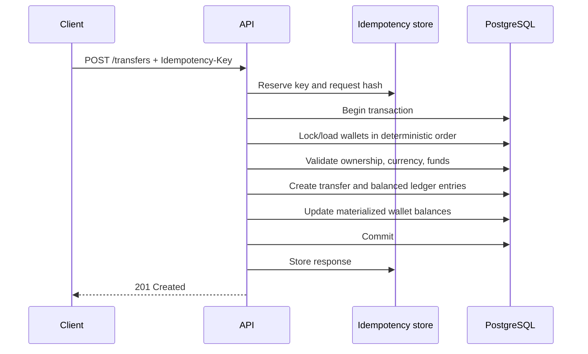

# Fintech Transaction API — delivery plan

Current delivery status: the complete financial workflow, operational hardening, recruiter documentation, deterministic smoke-demo automation, and transactional transfer outbox persistence are implemented. Local build and all automated tests pass. The Docker image, complete migration chain, PostgreSQL/Redis readiness checks, and end-to-end smoke demo have been verified successfully.

Planning documents:

- [Product requirements and acceptance criteria](docs/01-product-requirements.md)
- [Detailed implementation plan](docs/02-implementation-plan.md)

## 1. Outcome

Build one convincing, runnable C# project that proves transferable backend experience in the .NET ecosystem. The finished repository must demonstrate financial correctness and production thinking, not merely CRUD endpoints.

The project is complete when a reviewer can clone it, run one command, open Swagger, authenticate, create wallets, execute and retry transfers safely, process signed webhooks, reconcile records, run settlements, and execute the automated tests.

## 2. Scope boundaries

### In scope

- Local users with `Customer`, `Operations`, and `Admin` roles.
- Wallets in one currency per wallet.
- Internal wallet-to-wallet transfers.
- Immutable double-entry ledger records.
- Idempotent commands and deduplicated provider webhooks.
- Mock external payment provider adapter.
- Reconciliation runs and settlement batches.
- Audit trail, observability, Docker, CI, and documentation.

### Deliberately out of scope for version 1

- Card number storage or real card-network integration.
- Foreign-exchange conversion.
- Multi-region consensus.
- A frontend application.
- Claims of PCI-DSS certification.

The README may discuss PCI-DSS-aligned principles, but the project must not imply certification.

## 3. Proposed solution structure

```text
FintechPayments.sln
src/
  FintechPayments.Api/
  FintechPayments.Application/
  FintechPayments.Domain/
  FintechPayments.Infrastructure/
tests/
  FintechPayments.UnitTests/
  FintechPayments.IntegrationTests/
docs/
  api-examples.md
  database.md
  threat-model.md
.github/workflows/ci.yml
compose.yaml
Dockerfile
```

Dependency direction:

```text
Api -> Application <- Infrastructure
            |
          Domain
```

Domain code has no dependency on ASP.NET Core, EF Core, Redis, or provider SDKs. Application code owns use cases and abstractions. Infrastructure implements persistence and integrations. API code translates HTTP into application commands and queries.

## 4. Domain and data design

### Main records

| Record | Important fields | Key invariant |
|---|---|---|
| `User` | Id, Email, PasswordHash, Role, Status | Email is unique and normalized |
| `Wallet` | Id, OwnerId, Currency, AvailableBalance, Version | Balance cannot fall below zero |
| `Transfer` | Id, SourceWalletId, DestinationWalletId, Amount, Currency, Status, Reference | Source and destination differ |
| `LedgerTransaction` | Id, TransferId, Type, CreatedAt | Groups one balanced accounting event |
| `LedgerEntry` | Id, LedgerTransactionId, WalletId, Direction, Amount | Total debits equal total credits |
| `IdempotencyRecord` | Key, UserId, RequestHash, StatusCode, ResponseBody, ExpiresAt | Same key cannot represent another request |
| `WebhookEvent` | Provider, ExternalEventId, PayloadHash, Status, ReceivedAt | Provider/event ID pair is unique |
| `ReconciliationRun` | Id, PeriodStart, PeriodEnd, Status, Totals | Differences are recorded, never hidden |
| `ReconciliationItem` | RunId, InternalReference, ExternalReference, Difference, Resolution | Every mismatch is traceable |
| `SettlementBatch` | Id, Period, Currency, Gross, Fees, Net, Status | Net calculation is reproducible |
| `AuditEvent` | ActorId, Action, EntityType, EntityId, Metadata, CreatedAt | Append-only and correlation-aware |

Use integer minor units internally only if the currency model explicitly stores exponent rules; otherwise use `decimal` with constrained scale. For this portfolio version, use `decimal(19,4)`/PostgreSQL `numeric(19,4)` and validate supported currency precision at the boundary.

### Database constraints and indexes

- Unique normalized user email.
- Unique `(OwnerId, Currency)` wallet pair.
- Unique transfer reference.
- Unique `(UserId, IdempotencyKey)`.
- Unique `(Provider, ExternalEventId)`.
- Check constraints for positive amounts and valid balance values.
- Index ledger entries by `(WalletId, CreatedAt, Id)` for cursor pagination.
- Index transfers by source wallet, destination wallet, status, and creation time.
- Concurrency token on wallets.

## 5. Transfer workflow



If the same key and identical request are retried, return the stored response. If the same key is reused with a different request hash, return `409 Conflict`. PostgreSQL uniqueness is authoritative; Redis may coordinate or cache but must not be the only duplicate-payment defense.

## 6. Endpoint behavior

### Transfers

`POST /api/v1/transfers`

- Requires `Customer` role and `Idempotency-Key`.
- Validates positive amount, matching currencies, wallet ownership, and sufficient funds.
- Returns `201` for the first successful call and the equivalent stored result for a retry.
- Returns RFC 9457 problem details for validation and business errors.

### Webhooks

`POST /api/v1/webhooks/payments/mock-provider`

- Reads the raw body and validates timestamped HMAC signature using constant-time comparison.
- Rejects stale timestamps and invalid signatures.
- Persists the event before processing.
- Treats a duplicate external event as a successful no-op.
- Returns quickly; later milestone may process via an outbox worker.

### Reconciliation

`POST /api/v1/reconciliations`

- Restricted to `Operations` and `Admin`.
- Compares provider transaction input with internal transfers for a requested period.
- Produces matched, missing-internal, missing-external, and amount-mismatch items.
- Is itself idempotent for provider/period/input checksum.

### Settlement

`POST /api/v1/settlements`

- Restricted to `Operations` and `Admin`.
- Creates a deterministic batch for a period and currency.
- Calculates gross amount, fees, adjustments, and net amount.
- Prevents overlapping finalized batches.

## 7. Delivery milestones

### Milestone 0 — foundation

- Create solution and projects with enforced dependency direction.
- Add central package/version and build settings.
- Configure options validation, health checks, problem details, correlation IDs, structured logs, and OpenAPI.
- Add Dockerfile, Compose services for API/PostgreSQL/Redis, and an initial CI workflow.

Acceptance: solution builds, API health checks identify database and Redis status, Swagger loads, and CI runs.

### Milestone 1 — identity and wallets

- Add EF Core context and first migration.
- Implement registration/login, password hashing, JWT issuance, roles, and authorization policies.
- Implement wallet creation/detail endpoints and seed development roles/admin safely.
- Add ownership/role authorization tests.

Acceptance: a user can authenticate and access only authorized wallet data; secrets and password hashes never appear in responses or logs.

### Milestone 2 — ledger and atomic transfers

- Implement money value validation and transfer state model.
- Implement double-entry journal and atomic balance updates.
- Choose deterministic row-lock ordering or optimistic concurrency and retries.
- Add insufficient-funds, rollback, ledger-balance, and simultaneous-transfer tests.

Acceptance: injected failures leave no partial entries; all journal transactions balance; concurrent transfers cannot overspend.

### Milestone 3 — idempotency

- Add API idempotency middleware/filter and persistent records.
- Hash normalized request identity, reserve keys, store completed responses, and handle in-progress requests.
- Optionally use Redis for short-lived coordination and cached responses.

Acceptance: repeated identical transfer calls create one transfer; conflicting key reuse returns `409`; behavior survives API restart.

### Milestone 4 — provider webhooks

- Define provider adapter and mock provider event schema.
- Verify HMAC signatures and timestamp tolerance.
- Deduplicate events and implement valid state transitions.
- Add replay, invalid signature, malformed event, and duplicate delivery tests.

Acceptance: each valid external event has at most one business effect and an auditable processing result.

### Milestone 5 — reconciliation and settlement

- Import deterministic mock provider statements.
- Compare internal and external records and persist discrepancies.
- Generate settlement batches and compensating adjustments.
- Document operational resolution workflow.

Acceptance: a seeded mismatch is visible through the reconciliation API, resolvable, and reflected in a reproducible settlement total.

### Milestone 6 — production polish

- Add pagination, rate limiting, readiness/liveness checks, metrics, audit events, and redaction.
- Add complete Swagger examples and an HTTP request collection.
- Add architecture decision records and database diagram.
- Tighten CI with formatting, test coverage output, migration validation, and Docker build.
- Record a short demo or add screenshots.

Acceptance: a new reviewer can run and understand the project from the README without private setup knowledge.

## 8. Test matrix

| Level | Required scenarios |
|---|---|
| Domain unit | Invalid money, currency mismatch, insufficient funds, balanced postings, legal state transitions |
| Application unit | Authorization, request validation, idempotency conflict, provider mapping, settlement math |
| Persistence integration | Constraints, transaction rollback, migrations, concurrency token behavior |
| API integration | JWT success/failure, role policies, problem details, retry semantics, pagination |
| Infrastructure integration | Redis unavailable fallback, webhook HMAC verification, PostgreSQL locking |
| Concurrency | Many requests against one wallet, duplicate idempotency keys, opposing transfers without deadlock |
| End-to-end | Register -> fund fixture -> transfer -> webhook -> reconcile -> settle |

Tests involving PostgreSQL semantics must not use EF Core's in-memory provider. Use disposable real PostgreSQL and Redis containers.

## 9. Security checklist

- Use the platform password hasher; never write custom password cryptography.
- Validate JWT issuer, audience, signature, lifetime, and clock skew.
- Enforce ownership in the application layer as well as endpoint policies.
- Store webhook secrets outside source control and support rotation identifiers.
- Compare webhook signatures in constant time and reject replay windows.
- Apply request-size limits and rate limiting.
- Redact authorization headers, passwords, tokens, signatures, and personal data from logs.
- Parameterize database access through EF Core.
- Return generic client errors with correlation IDs; log internal exceptions once.
- Keep the ledger and audit trail append-only; reverse with compensating records.
- State clearly that no cardholder data is stored and that the demo is not PCI-DSS certified.

## 10. Interview-learning map

Implement each topic through a visible feature:

| .NET topic | Project proof |
|---|---|
| `async`/`await` and `Task` | Async EF Core, Redis, and HTTP boundaries with cancellation tokens |
| Dependency injection | Application interfaces and infrastructure registrations |
| Middleware | Correlation ID, exception mapping, authentication, idempotency |
| Controllers vs Minimal APIs | Use controllers; document why they suit a larger grouped API |
| EF Core and LINQ | Mappings, migrations, projections, compiled/query-efficient reads |
| Transactions/concurrency | Atomic transfer service and race-condition tests |
| JWT authentication | Login flow, claims, roles, policies |
| xUnit | Unit and integration suites |
| SOLID/Clean Architecture | Dependency direction and replaceable provider/cache adapters |
| Logging/configuration | Structured events, options validation, environment-specific settings |

For every major feature, be ready to explain the failure mode it prevents, the chosen tradeoff, and what would change at production scale.

## 11. Career-transition narrative

Use this structure and replace placeholders with truthful details:

> My background is in backend engineering, where I worked on [APIs/services] handling [verified scale or business impact]. The core problems—reliability, authentication, database performance, production diagnosis, and safe delivery—transfer across languages. I built this C# fintech API to make that transfer concrete. It uses ASP.NET Core and EF Core to implement atomic, idempotent transfers, a double-entry ledger, signed webhooks, reconciliation, and automated tests. I do not claim prior professional .NET experience; I can show how quickly I applied my existing engineering judgment in the .NET ecosystem and explain the tradeoffs in the code.

Strong follow-up examples should cover:

- A real performance or database optimization, with measured before/after evidence.
- A production incident and how diagnosis, communication, and prevention were handled.
- A security decision involving authentication, authorization, or sensitive data.
- A collaboration or leadership example with a concrete outcome.
- One project tradeoff: for example, synchronous ledger posting now, outbox/event processing later.

Never invent concurrency numbers, revenue impact, team size, or professional C# experience. Label synthetic load-test results as project benchmarks.

## 12. Recruiter-ready definition of done

- CI badge is green on the default branch.
- `docker compose up --build` works from a clean clone.
- README explains problem, architecture, stack, setup, API, database, testing, security, and scalability.
- OpenAPI describes authentication, idempotency headers, examples, and error responses.
- Database diagram and at least three architecture decisions are documented.
- Demo seed or script supports a five-minute walkthrough.
- Unit, integration, concurrency, and end-to-end tests are present and stable.
- No secrets, false claims, placeholder prose, or broken commands remain.
- Repository is pinned on GitHub only after the runnable path is verified.

## 13. Recommended implementation order

Work milestone by milestone and keep the main branch demonstrable. Do not begin reconciliation before atomic transfer and idempotency tests pass. The highest-value interview slice is milestones 0 through 3; finish those deeply before widening scope.
