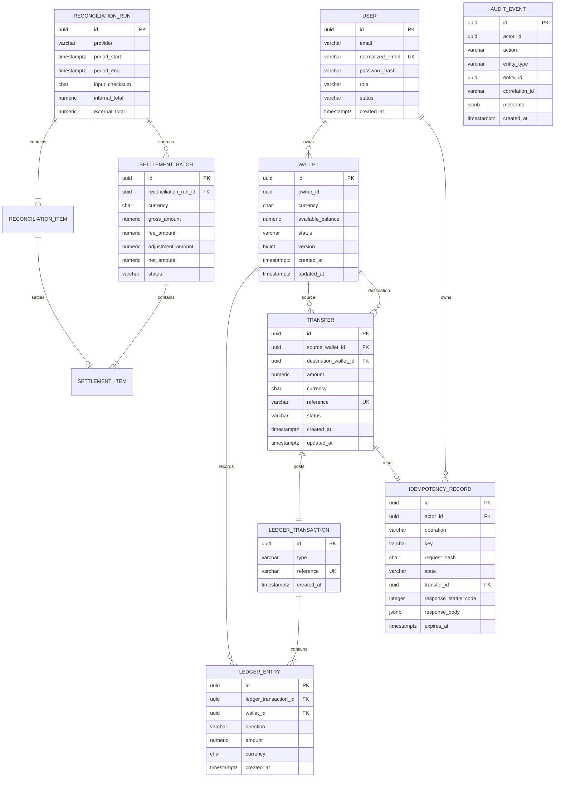

# Database design

## Current schema

The migrations establish the complete transaction-processing model. PostgreSQL is the source of truth; Redis is not used to determine financial correctness.



Current guarantees:

- Normalized email is unique and password hashes are never returned through API contracts.
- `numeric(19,4)` stores wallet balances without floating-point rounding.
- A check constraint prevents a negative materialized balance.
- A unique `(owner_id, currency)` index permits one wallet per currency per owner.
- Currency codes are fixed at three characters and validated in the domain.
- `version` is an application-managed concurrency token. Transfer code must increment it when updating a wallet.
- Timestamps use PostgreSQL `timestamp with time zone` and the domain normalizes creation time to UTC.
- Ledger transaction references are unique, entries require positive `numeric(19,4)` amounts, and foreign keys use restricted deletion.
- Wallet ledger reads use the `(wallet_id, created_at, id)` index and keyset cursors rather than offset pagination.
- A completed transfer has one ledger transaction through a unique, restricted `transfer_id` foreign key.
- Transfer execution locks both wallet rows in deterministic UUID order before rechecking funds and posting all changes in one PostgreSQL transaction.
- `(actor_id, operation, key)` uniquely identifies an idempotent request. The request hash detects conflicting reuse, while the stored status and JSON response support deterministic replay after process or cache restarts.
- `(provider, period_start, period_end, input_checksum)` makes identical reconciliation input idempotent.
- Each reconciliation item can appear in at most one settlement through a unique input-item index.
- Settlement finalization uses serializable isolation and rejects overlapping finalized currency periods.
- Audit records are indexed by actor, entity, and correlation ID; a PostgreSQL trigger rejects updates and deletes.

The wallet balance is a transactional projection updated with the immutable ledger in the same transfer transaction.

## Migration commands

Restore the repository-local EF tool:

```bash
dotnet tool restore
```

Create a migration:

```bash
dotnet tool run dotnet-ef migrations add MigrationName \
  --project src/FintechPayments.Infrastructure \
  --startup-project src/FintechPayments.Api \
  --output-dir Persistence/Migrations
```

Apply migrations to the configured PostgreSQL instance:

```bash
dotnet tool run dotnet-ef database update \
  --project src/FintechPayments.Infrastructure \
  --startup-project src/FintechPayments.Api
```

Production startup will not silently apply migrations. Deployment automation must run reviewed migrations explicitly.
